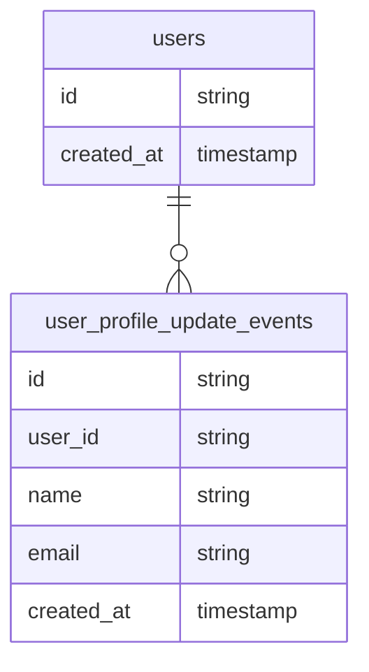
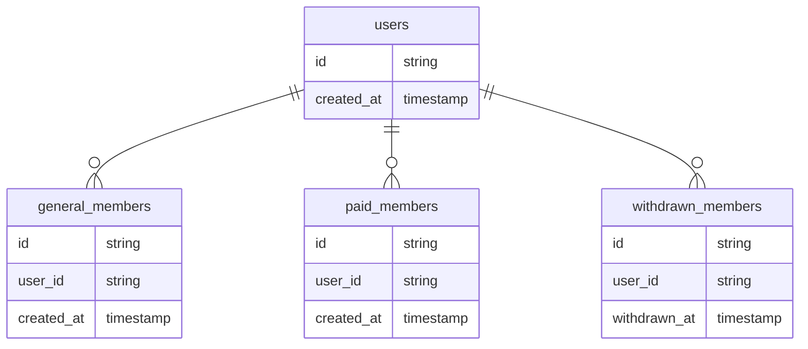

## TL;DR

1. ViewはRDMBSのテーブルとアプリケーションのモデルの間のミスマッチを解消する
2. ORMとも相性が良い
3. tblsを使うと、Viewと参照下のテーブルの関係を可視化しやすい

## Viewとは何か

Viewは、RDMSにおける、SQLの結果をテーブルのように扱える仮想的なテーブルです。
物理的にはデータは保存されていませんが、テーブルと同じように扱えるため、同じSQLを複数箇所で使いまわすことができます。
ORMを使っている場合も、Viewはテーブルと同じように扱えるため、複数テーブルに対するクエリを持ったViewを擬似的に一つのテーブルとして扱うことができます。

## インピーダンスミスマッチとView
### インピーダンスミスマッチとは

インピーダンスミスマッチとは、データベースとアプリケーションのモデルの間のミスマッチのことです。
例えば、RDBMSでは、1つのテーブルに複数のテーブルを結合した結果を格納することはできません。
しかし、アプリケーションのモデルでは、1つのオブジェクトに複数のオブジェクトを結合した結果を格納することができます。
このようなミスマッチがインピーダンスミスマッチです。

特にイミュータブルデータモデルを採用している場合、アプリケーションのモデルで複数のイベントやリソースを一つのエンティティとして扱いたい場合があります。
また、クラステーブル継承をしている場合もORMの支援がなければ、インピーダンスミスマッチが発生します。

### Viewはインピーダンスミスマッチを解消する

上述の通り、Viewは複数のテーブルに対するクエリを一つのテーブルとして扱うことができます。
つまり、アプリケーションで必要な形にデータを変換することができるので、インピーダンスミスマッチを解消することができます。
いくつかの例を見てみましょう。

#### 更新イベントとView

イミュータブルデータモデルをしている場合、リソースエンティティと更新イベントエンティティを別々に保存することが多いです。
最新の値は更新イベントエンティティに保存されているため、リソースエンティティを取得する際には、更新イベントエンティティを結合して最新の値を取得する必要があります。

仮に以下のような

- ユーザーテーブル(users)
- ユーザープロフィール更新イベントテーブル(user_profile_update_events)

があるとします。



この場合、ユーザーの最新のプロフィールを取得する際には、以下のようなクエリを書く必要があります。

```sql
SELECT
    users.id,
    users.created_at,
    user_profile_update_events.name,
    user_profile_update_events.email,
    user_profile_update_events.created_at
FROM
    users
LEFT JOIN
    user_profile_update_events
ON
    users.id = user_profile_update_events.user_id
INNER JOIN (
    SELECT 
      user_profile_update_events.user_id, 
      MAX(user_profile_update_events.created_at) AS max_created_at
    FROM user_profile_update_events
    GROUP BY user_profile_update_events.user_id
) AS latest_events ON user_profile_update_events.user_id = latest_events.user_id
AND user_profile_update_events.created_at = latest_events.max_created_at

```

このクエリは、ユーザーの最新のプロフィールを取得するクエリですが、複雑なクエリになっています。
このクエリをViewにしてしまえば、アプリケーションからはViewをテーブルとして扱うことができるため、Viewを使って簡単に最新のプロフィールを取得することができます。

また、後からパフォーマンスが問題になった場合、最新のプロフィール情報をusersテーブルにカラムとして追加するという判断をした場合も、データを更新する部分のロジックと、Viewを変更するだけで対応することができます。

#### クラステーブル継承とView

クラステーブル継承とは、親テーブルと子テーブルを作成し、親テーブルには共通のカラムを、子テーブルには親テーブルのカラムに加えて子テーブル固有のカラムを持たせるテーブル設計のことです。

例えば、以下のようなテーブルがあるとします。

- ユーザーテーブル(users)
- 一般会員テーブル(general_members)
- 有料会員テーブル(paid_members)
- 退会会員テーブル(withdrawn_members)




## tblsとView

Viewはとても便利ですが、Viewの管理はテーブルの管理よりも煩雑です。
なぜならViewはテーブルとは違い、下記のような特徴があるためです。

- 複数のテーブル定義を参照できる
- 外部キー等でER図上から他テーブルの関連を表示できない

このような特徴があるため、Viewの管理はテーブルの管理よりも煩雑になります。
しかし、tblsを使うことで、Viewの管理を簡単にすることができます。

### tblsとは何か

既存のDBスキーマからER図、テーブル一覧、テーブル詳細などのドキュメントを生成するツールです。
tblsについては下記の記事でより詳しく書いていますので、そちらを参考にしてください。
https://zenn.dev/micin/articles/2023-12-05-majimaccho-tbls#tbls%E3%81%A8%E3%81%AF

### tblsを使うと、Viewと参照下のテーブルの関係を可視化しやすい

tblsは特に設定をしなくとも、Viewと参照下のテーブルの関係を表示してくれます。


また、Viewpointを定義し、その中に関連するViewをまとめることで、ユースケースとViewの関係をわかりやすくすることができます。
下の画像では書籍情報に関連するテーブルのまとまりをViewpointとして定義しており、そのテーブルと参照しているViewを同じViewpointにまとめています。


tblsとViewを組み合わせて使うことで、Viewの内容をよりわかりやすくドキュメント化することができます。
また、Viewpoint内のテーブルの参照され方もわかりやすくなるため、よりViewpointsの情報を活用しやすくなります。

## 参考文献