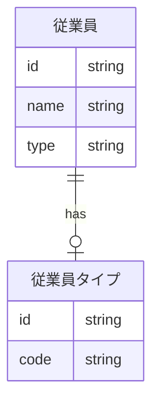
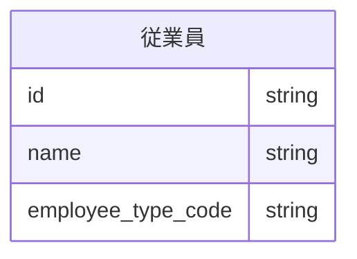

## はじめに

GraphQLを実装する上で、RDB上のデータ形式とGraphQLのモデルの形式が異なるり、実装が複雑になってしまうことで悩んだことはありませんか？
この記事では、GraphQLとRDBのインピーダンスミスマッチについて考え、その解消方法について紹介します。

## TL;DR

GraphQLのモデルとRDBのテーブルは同じ形にするべきではありません。
GraphQLのモデルはAPIのクライアントから見たモデルの関係を示す構造になっているべきであり、
RDBは事実を信頼性のある形で残すように正規化を行うべきです。
両者を同じ形にすることはクライアントかRDBに問題を押し付ける形になります。
これらのインピーダンスミスマッチを解消する方法の一つとしてRDBのViewを使うことが有効です。

## GraphQL特有の問題

GraphQLはモデルがGraph構造になっているため、各モデルのResolverをナイーブに実装するとモデルからモデルの参照でN＋1を発生させます。
多くの場合はDataLoaderという仕組みを使ってN＋1クエリを1＋1にしますが、DataLoaderはナイーブな実装に比べて複雑なため、実装とテストのコストが高いです。

Prismaといった一部のORMとして使われるライブラリにはDataLoaderを内蔵しているものがあり、これらを使用すると多くのユースケースではDataLoaderの実装コストは無視できるものになります。

## GraphQLとRDBのインピーダンスミスマッチ

HasuraやApp Syncでは基本的にGraphQLのモデルとRDBのテーブルが同義に扱われますが、これは望ましくありません。

GraphQLのモデルはAPIのクライアントから見たモデルの関係を示す構造になっているべきであり、RDBは事実を信頼性のある形で残すように正規化を行います。
そのため、両者を同じ形にすることはクライアントかRDBに問題を押し付ける形になります。
具体的には以下のような問題が考えられます。

### インピーダンスミスマッチの例
従業員のモデルについて考えます。従業員には正社員、業務委託、インターンがある場合、以下のようなモデルが考えられます。

(このモデルの是非については色々なご意見があると思いますが、今回の本筋ではないためご勘弁ください。)



この場合にGraphQLのスキーマとしては、以下のように扱いたいとします。

```graphql
enum EmployeeTypeCode {
  FULLTIME
  CONTRACT
  INTERN
}

type Employee {
  id: ID!
  name: String!
  employeeTypeCode: EmployeeTypeCode!
}
```

### RDBの構造を崩す場合

RDBをGraphQLのスキーマに合わせる場合、以下のようなテーブル構造になります。



こうした場合、RDBのテーブルは正規化されていないため、データの整合性が保たれません。
不正なデータが入る可能性があり、データの信頼性が低下します。

### GraphQLの構造を崩す場合

逆に、RDBのテーブルをGraphQLのスキーマに合わせる場合、以下のようなスキーマになります。

```graphql
type Employee {
  id: ID!
  name: String!
  employeeType: EmployeeType!
}

type EmployeeType {
  id: ID!
  code: EmployeeTypeCode!
}
```

この場合、以下の問題があります。

#### RDBへのクエリの回数が増える
EmployeeTypeを取得するためにEmployeeモデルを経由して取得するためDataLoaderの実装が必要になります。
上の例では一回で済んでいたクエリが2回に増えるため、パフォーマンスが低下します。

#### クライアントからは関心のないデータ構造が露出される

クライアントはEmployeeに紐づくEmployeeType.codeさえ取得できれば良いですが、EmployeeTypeがEmployeeとは違うモデルというように表現されています。
クライアントから見ると必要のない複雑さを持ち込むことになります。

### モデルのネストが深くなる

EmployeeTypeがEmployeeにネストされているため、クライアント側での取り回しが煩雑になります。
また、GraphQLでは過負荷を避けたり、脆弱性への対策からクエリのネストの深さを制限することもあり、必要以上に深いネストを持つことは避けるべきです。

## インピーダンスミスマッチの解消

GraphQLとRDBのインピーダンスミスマッチを解消する方法は具体的には以下のようなものが考えられます。

1. アプリケーションコードで整形する
1. 生のSQLで整形する
1. Viewを使う

## アプリケーションコードで整形する場合

アプリケーションコードで整形する場合の実装は以下のようになります。

```typescript
export const employeeTypeLoader = new DataLoader<string, Employee>(async (ids) => {
  const employees = await prisma.employee.findMany({
    where: {
      id: {
        in: ids,
      },
    },
    include: {
      employeeType: true,
    }
  });

  return ids.map((id) => {
    const employee = employees.find((employeeType) => employeeType.id === id)?.code)
    return {
      id: employee.id,
      name: employee.name,
      employeeTypeCode: employee.employeeType.code,
    }
  };
});
```

RDBからORM等でデータを取得し、アプリケーションコードで整形します。

この場合、データの整形のコードが必要になります。
本来でデータ整形のコードはRDB側で行うべきですが、この場合はアプリケーションコードで整形することになります。
加えて、DataLoaderの実装が必要になり、コードがより煩雑になります。

## 生のSQLで整形する場合

生のSQLで整形する場合の実装は以下のようになります。[^2]

```typescript
const employeeTypeLoader = new DataLoader<string, Employee>(async (ids) => {
  const employees = await prisma.$queryRaw`
    SELECT
      employees.id as id,
      employees.name,
      employee_types.code as employeeTypeCode
    FROM
      employees
    JOIN
      employee_types
    ON
      employees.employee_type_id = employee_types.id
    WHERE
      employees.id IN (${ids})
  `;

  return employees.map((employee) => ({
    id: employee.id,
    name: employee.name,
    employeeTypeCode: employee.employeeTypeCode,
  });
});
```

RDBから生のSQLでデータを取得します。

この場合、当然ながらRDBから整形された状態でデータが取得できます。
CASE句やUNIONなどを使ってデータを整形することもできます。
ただし、依然としてDataLoaderの実装が必要になり、コードが煩雑になります。

この例ではSQLを直接書いていますが、sqlc[^2]等のライブラリを使うことでコードを簡潔にすることができます。


## Viewで整形する場合

Viewで整形する場合の実装は以下のようになります。

```sql
CREATE VIEW employee_view AS
SELECT
  e.id,
  e.name,
  et.code as employeeTypeCode
FROM
  employees
JOIN
  employee_types 
ON
  employees.employee_type_id = employee_types.id
```

```typescript
import { prisma } from 'sr/lib/prisma';
import { Employee } from './generated/graphql';

const employees = (ids: string[]) => {
  return prisma.employeeView.findMany({
    where: {
      id: {
        in: ids,
      },
    }
  });
};
```


こちらもRDBから整形された状態でデータが取得でき、CASE句やUNIONなどを使ってデータを整形することもできます。
他の二つと大きく違うのは、Prisma等を使っているのであればDataLoaderの実装を無視できることです。
DataLoaderの実装が不要になると上記のように、コードが簡潔になり、テストも容易です。

## Viewが使えないパターン

Viewは実態としてはサブクエリであるため、以下のような場合にはViewを使うことは現実的ではありません。

### 集計

Viewはサブクエリであるため、Viewに対してwhere句で絞り込みをかけた場合、Viewの参照テーブルの全てのデータを取得してから絞り込みをかけることになります。
理想としては、参照テーブルに対して絞り込みをした後に集計を行いたいところですが、Viewを使うとそのようなことができません。
全テーブルに対して集計処理をかけてから絞り込みを行うことになり、パフォーマンスが極端に悪化します。


### 並び替え

集計と同様に、Viewはサブクエリであるため、Viewに対してorder by句を使って並び替えをかけた場合、Viewの参照テーブルの全てのデータを取得してから並び替えをかけることになります。
Viewに対して絞り込みをかけても、並び替え処理は全てのデータに対して行われるため、パフォーマンスが極端に悪化します。

### 対処法

集計や並び替えを行う場合は、Viewを使わずに生のSQLを使うか、アプリケーションコードで整形するかを選択する必要があります。

ただし、集計処理はORMでの取り回しが悪いことが多いため、筆者は生のSQLを使うことが多いです。

また、並び替えが必要な場合には、並び替えのみを行うResolverを定義し、そこから先をViewと同一のモデルを参照するようにして、Viewを使わない範囲を明確にすることが有効です。

[^1]この形式のクエリはIN句を使っているため、idsの数が多い場合にはパフォーマンスが悪化する可能性があります。

[^2]: https://sqlc.dev