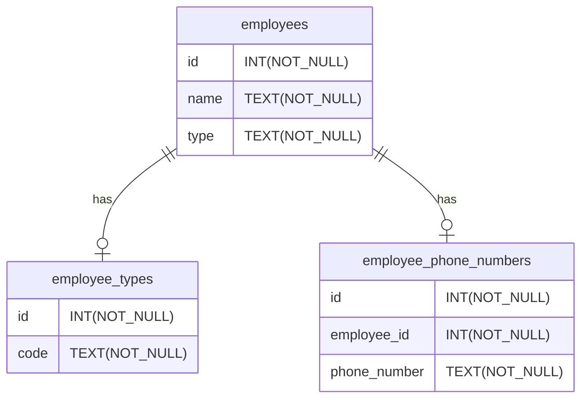
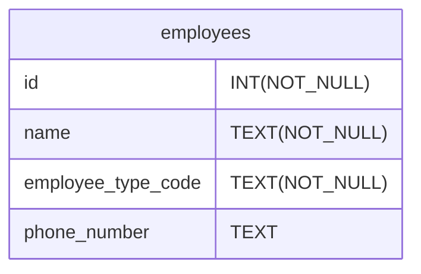

## はじめに

GraphQLを実装する上で、リレーショナルデータベース(以下、RDB)上のデータ形式とGraphQLのモデルの形式が異なり、実装が複雑になってしまうことで悩んだことはありませんか？
この記事では、GraphQLとRDBのインピーダンスミスマッチ[^1]について考え、その解消方法について紹介します。


## TL;DR

GraphQLのモデルとRDBのテーブルは以下の目的の違いがあるため、同じ形にするべきではありません。
- GraphQLのモデルはAPIのクライアントから見たモデルの関係を示す
- RDBは事実を信頼性のある形で残すように正規化を行う

両者を同じ形にすることはクライアントかRDBに問題を押し付ける形になります。
これらのインピーダンスミスマッチを解消する方法の1つとしてRDBのViewを使うことが有効です。

## GraphQLとRDBのインピーダンスミスマッチ

HasuraやApp Syncでは基本的にGraphQLのモデルとRDBのテーブルが同義に扱われますが、これは望ましくありません。

GraphQLのモデルはAPIのクライアントから見たモデルの関係を示す構造になっているべきであり、RDBは事実を信頼性のある形で正規化されているべきです。
多くの場合、この両者の構造は異なっているでしょう。
そのため、両者を同じ形にすることはクライアントかRDBに問題を押し付ける形になります。
具体的には以下のような問題が考えられます。

## インピーダンスミスマッチの例
従業員のモデルについて考えます。
- 従業員には正社員、業務委託、インターンがある
- 従業員には任意で登録される電話番号がある

ここで、まずはイミュータブルデータモデル[^2]を意識してRDBのテーブル設計をすると以下のようになります。

(このモデルの是非については色々なご意見があると思いますが、今回の本筋ではないためご勘弁ください。)



この場合にGraphQLのスキーマとしては、以下のように扱いたいとします。

```graphql
enum EmployeeTypeCode {
  FULLTIME
  CONTRACT
  INTERN
}

type Employee {
  id: ID!
  name: String!
  employeeTypeCode: EmployeeTypeCode!
  phoneNumber: String # オプショナルなことに注意
}
```

EmployeeモデルがEmployeeTypeとPhoneNumberをどのように持つかがRDBとGraphQLで異なるため、インピーダンスミスマッチが発生します。
この例のように、RDBでは正規化やNullableなカラムを避けるためにテーブル分割を行うことがありますが、GraphQLのレイヤーではこれらのテーブルに跨った属性を1つのモデルとして扱ったほうが都合が良いことが多いです。

この記事ではこういったモデルの違いをどのように扱えば良いかを考えます。

:::message
インピーダンスミスマッチの例としてよく挙げられる、RDB上の中間テーブルを利用した多対多の関係については、GraphQLではResolverの単純な実装で自然に解消できるため、ここでは扱いません。
:::

### RDBの構造を崩す場合

RDBをGraphQLのスキーマに合わせる場合、以下のようなテーブル構造になります。



こうした場合、RDBのテーブルは正規化されていないため、データの整合性が保たれません。
不正なデータが入る可能性があり、データの信頼性が低下します。
また、NOT NULL制約が設定されていないため、検索のバグが混入したり、検索速度が低下する可能性があります。

### GraphQLの構造を崩す場合

逆に、GraphQLのスキーマをRDBのテーブルに合わせる場合、以下のようなスキーマになります。

```graphql
type Employee {
  id: ID!
  name: String!
  employeeType: EmployeeType!
  phoneNumber: EmployeePhoneNumber
}

type EmployeeType {
  id: ID!
  code: EmployeeTypeCode!
}

enum EmployeeTypeCode {
  FULLTIME
  CONTRACT
  INTERN
}

type EmployeePhoneNumber {
  id: ID!
  phoneNumber: String!
}

```

この場合、以下の問題があります。

#### RDBへのクエリの回数が増える
EmployeeTypeとEmployeePhoneNumberを取得するためにEmployeeモデルを経由して取得するためDataLoader[^4]の実装が必要になります。
上の例では1回で済んでいたクエリが3回に増えるため、パフォーマンスが低下します。

#### クライアントからは関心のないデータ構造が露出される

従業員タイプを取得する際にクライアントはEmployeeに紐づくEmployeeType.codeさえ取得できれば良いですが、EmployeeTypeがEmployeeとは違うモデルというように表現されています。
クライアントから見ると必要のない複雑さを持ち込むことになります。

#### モデルのネストが深くなる

EmployeeTypeとEmployeePhoneNumberがEmployeeにネストされているため、クライアント側での取り回しが複雑になります。
また、GraphQLでは過負荷を避けたり、脆弱性への対策からクエリのネストの深さを制限することもあり、必要以上に深いネストを持つことは避けるべきです。

## GraphQL特有の問題

GraphQLはモデルがGraph構造になっているため、各モデルのResolverをナイーブに実装するとモデルからモデルの参照でN＋1を発生させます。
多くの場合はDataLoaderを使ってN＋1クエリを1＋1にしますが、DataLoaderはナイーブな実装に比べて複雑なため、実装とテストのコストが高いです。
必要以上にモデルのネストが深くなることは、DataLoaderの実装コストの高さからも避けるべきです。

:::message
ただし、Prismaといった一部のORMとして使われるライブラリにはDataLoaderを内蔵しているものがあり、これらを使用すると多くのユースケースではDataLoaderの実装コストは無視できるものになります。
:::


## インピーダンスミスマッチの解消

GraphQLとRDBのインピーダンスミスマッチを解消するにはRDBのデータ形式からGraphQLのデータ形式に変換する必要があります。
この変換を行う方法として以下の3つが考えられます。

1. アプリケーションコード
1. 生のSQL
1. View

## アプリケーションコードで変換する場合

アプリケーションコードで変換する場合の実装は以下のようになります。

```typescript
export const employeeTypeLoader = new DataLoader<string, Employee>(async (ids) => {
  const employees = await prisma.employee.findMany({
    where: {
      id: {
        in: ids,
      },
    },
    include: {
      employeeType: true,
      employeePhoneNumber: true,
    }
  });

  return ids.map((id) => {
    const employee = employees.find((employeeType) => employeeType.id === id)?.code)
    return {
      id: employee.id,
      name: employee.name,
      employeeTypeCode: employee.employeeType.code,
      phoneNumber: employee.employeePhoneNumber?.phoneNumber,
    }
  };
});
```

RDBからORM等でデータを取得し、アプリケーションコードで変換します。

この場合、データの変換のコードが必要になります。
アプリケーションコードで変換する場合、RDBで整形する場合に比べてメモリ効率が悪く、コードが複雑になります。
加えて、DataLoaderの実装が必要になり、コードがより複雑になります。

## 生のSQLで変換する場合

生のSQLで変換する場合の実装は以下のようになります。[^3]

```typescript
const employeeTypeLoader = new DataLoader<string, Employee>(async (ids) => {
  const employees = await prisma.$queryRaw`
    SELECT
      employees.id as id,
      employees.name,
      employee_types.code as employee_type_code
      employee_phone_numbers.phone_number as phone_number
    FROM
      employees
    JOIN
      employee_types
    ON
      employees.employee_type_id = employee_types.id
    JOIN 
      employee_phone_numbers
    ON
      employees.id = employee_phone_numbers.employee_id    
    WHERE
      employees.id IN (${ids})
  `;

  return employees.map((employee) => ({
    id: employee.id,
    name: employee.name,
    employeeTypeCode: employee.employeeTypeCode,
    phoneNumber: employee.phoneNumber,
  });
});
```

RDBから生のSQLでデータを取得します。

この場合、当然ながらRDBから整形された状態でデータが取得できます。
CASE句やUNIONなどを使ってデータを整形することもできます。
ただし、依然としてDataLoaderの実装が必要になり、コードが複雑になります。

この例ではSQLを直接書いていますが、sqlc[^5]等のライブラリを使うことでコードを簡潔にすることができます。

## Viewで変換する場合

Viewで変換する場合の実装は以下のようになります。

```sql
CREATE VIEW employee_view AS
SELECT
  employees.id,
  employees.name,
  employee_types.code as employeeTypeCode
  employee_phone_numbers.phone_number as phoneNumber
FROM
  employees
JOIN
  employee_types 
ON
  employees.employee_type_id = employee_types.id
JOIN 
  employee_phone_numbers
ON
  employees.id = employee_phone_numbers.employee_id;
```

```typescript
import { prisma } from 'sr/lib/prisma';
import { Employee } from './generated/graphql';

const employees = (ids: string[]) => {
  return prisma.employeeView.findMany({
    where: {
      id: {
        in: ids,
      },
    }
  });
};
```


こちらもRDBから整形された状態でデータが取得でき、CASE句やUNIONなどを使ってデータを整形することもできます。
他の2つと大きく違うのは、Prisma等を使っているのであればDataLoaderの実装を無視できることです。
DataLoaderの実装が不要になると上記のように、コードが簡潔になり、テストも容易です。

## Viewが使えないパターン

Viewは実態としてはサブクエリであるため、以下のような場合にはViewを使うことは現実的ではありません。

### 集計

Viewはサブクエリであるため、Viewに対してwhere句で絞り込みをかけた場合、Viewの参照テーブルの全てのデータを取得してから絞り込みをかけることになります。
理想としては、参照テーブルに対して絞り込みをした後に集計したいところですが、Viewを使うとそのようなことができません。
全テーブルに対して集計処理をかけてから絞り込みを行うことになり、パフォーマンスが極端に悪化します。


### 並び替え

並び替えについてもViewが実質サブクエリであるためのパフォーマンスの問題があります。
並び替えに利用するカラムは通常インデックスが張られますが、Viewを使うとインデックスが効かなくなるため、パフォーマンスが悪化します。

### 対処法

集計や並び替えを行う場合は、Viewを使わずに生のSQLを使うか、アプリケーションコードで変換するかを選択する必要があります。
ただし、集計処理はORMでの取り回しが悪いことが多いため、筆者は生のSQLを使うことが多いです。

[^1]:インピーダンスミスマッチとはレイヤーや境界をまたいで情報をやり取りする際に生じる、情報の表現形式の違いによる問題のことです。
オブジェクト指向プログラミング言語とRDBの間に生じる問題を指すことが多いですが、今回はGraphQLとRDBの間のインピーダンスミスマッチについて考えます。
[https://ja.wikipedia.org/wiki/インピーダンスミスマッチ](https://ja.wikipedia.org/wiki/%E3%82%A4%E3%83%B3%E3%83%94%E3%83%BC%E3%83%80%E3%83%B3%E3%82%B9%E3%83%9F%E3%82%B9%E3%83%9E%E3%83%83%E3%83%81)


[^2]:[https://scrapbox.io/kawasima/イミュータブルデータモデル](https://scrapbox.io/kawasima/%E3%82%A4%E3%83%9F%E3%83%A5%E3%83%BC%E3%82%BF%E3%83%96%E3%83%AB%E3%83%87%E3%83%BC%E3%82%BF%E3%83%A2%E3%83%87%E3%83%AB)
[^4]: DataLoaderはネストしたクエリをバッチ処理で実行してN＋1を防ぐ仕組みです。 https://github.com/graphql/dataloader

[^3]:この形式のクエリはIN句を使っているため、idsの数が多い場合にはパフォーマンスが悪化する可能性があります。

[^5]: https://sqlc.dev